# Home SOC Lab — Windows Endpoint Detection with Splunk

A home Security Operations Center (SOC) built entirely with free tools on an Apple Silicon MacBook Air. This lab simulates real-world attack scenarios against a Windows 11 target, ingests logs into Splunk, and demonstrates detection engineering across 4 attack techniques mapped to MITRE ATT&CK.

The goal: think like an attacker, detect like a defender.

---

## Table of Contents
- [Lab Architecture](#lab-architecture)
- [Setup](#setup)
  - [Environment](#environment)
  - [Windows Logging Configuration](#windows-logging-configuration)
  - [Splunk SIEM Setup](#splunk-siem-setup)
  - [Log Forwarding Pipeline](#log-forwarding-pipeline)
- [Attack 1 — Network Reconnaissance (Nmap)](#attack-1--network-reconnaissance-nmap)
- [Attack 2 — RDP Brute-Force (Hydra)](#attack-2--rdp-brute-force-hydra)
- [Attack 3 — Post-Compromise Reconnaissance](#attack-3--post-compromise-reconnaissance)
- [Attack 4 — Obfuscated PowerShell Execution](#attack-4--obfuscated-powershell-execution)
- [MITRE ATT&CK Summary](#mitre-attck-summary)
- [Key Takeaways](#key-takeaways)

---

## Lab Architecture

```
┌───────────────────────────────────────────────────────────────────┐
│                        Host Machine                               │
│                   MacBook Air (Apple Silicon)                     │
│                                                                   │
│   ┌──────────────────┐          ┌────────────────────────────┐    │
│   │   Kali Linux     │          │   Splunk Enterprise (Free) │    │
│   │   (Attacker)     │          │   Listening on :9997       │    │
│   │   <KALI-ATTACKER-IP>   │          │   Web UI on :8000          │    │
│   └────────┬─────────┘          └───────────────▲────────────┘    │
│            │ Attack Traffic                     │ Log Forwarding  │
│            ▼                                    │                 │
│   ┌─────────────────────────────────────────────┴──────────────┐  │
│   │              Windows 11 Pro (Target)                       │  │
│   │              <WINDOWS-TARGET-IP>                                 │  │
│   │                                                            │  │
│   │  • Advanced Audit Policy (Process Creation + Logon)        │  │
│   │  • PowerShell Script Block + Module Logging                │  │
│   │  • Splunk Universal Forwarder → ships Security +           │  │
│   │    PowerShell/Operational logs to Splunk                   │  │
│   └────────────────────────────────────────────────────────────┘  │
│                   UTM Shared Network (192.168.64.0/24)            │
└───────────────────────────────────────────────────────────────────┘
```

| Host | IP | Role |
|---|---|---|
| Kali Linux (UTM VM) | <KALI-ATTACKER-IP> | Attacker |
| Windows 11 Pro (UTM VM) | <WINDOWS-TARGET-IP> | Target endpoint |
| macOS host | <SPLUNK-HOST-IP> | SIEM (Splunk) |

---

## Setup

### Environment

| Tool | Version | Purpose |
|---|---|---|
| UTM (QEMU) | 4.x | Hypervisor on Apple Silicon |
| Kali Linux | 2023 ARM64 | Attack platform |
| Windows 11 Pro | ARM64 (Build 26200) | Target endpoint |
| Splunk Enterprise | 10.4.1 (Free license) | SIEM — log ingestion, search, detection |
| Splunk Universal Forwarder | 10.4.1 | Log shipping agent on Windows |
| Nmap | 7.94 | Port scanning |
| Hydra | 9.5 | Brute-force tool |

---

### Windows Logging Configuration

Out of the box, Windows logs very little useful security telemetry. The first step in building any endpoint detection capability is enabling the right audit policies and PowerShell logging settings. This lab uses native Windows logging rather than third-party kernel drivers — a practical approach for environments where driver compatibility is a constraint.

**Enable Process Creation auditing with full command-line arguments:**

```powershell
# Enable process creation logging (success and failure)
auditpol /set /subcategory:"Process Creation" /success:enable /failure:enable

# Capture the full command line for every process — critical for detecting malicious tools
New-Item -Path "HKLM:\SOFTWARE\Microsoft\Windows\CurrentVersion\Policies\System\Audit" -Force
Set-ItemProperty -Path "HKLM:\SOFTWARE\Microsoft\Windows\CurrentVersion\Policies\System\Audit" `
    -Name "ProcessCreationIncludeCmdLine_Enabled" -Value 1 -Type DWord
```

Without the second step, Windows logs that `powershell.exe` started, but not what command it ran. With it, you see the full command line — the difference between knowing an attack happened and knowing exactly what the attacker did.

**Enable logon and account lockout auditing:**

```powershell
auditpol /set /subcategory:"Logon" /success:enable /failure:enable
auditpol /set /subcategory:"Account Lockout" /success:enable /failure:enable
```

**Enable PowerShell Script Block Logging:**

```powershell
# Script Block Logging — logs every PowerShell command before it executes,
# including the DECODED version of any Base64-encoded or obfuscated commands
New-Item -Path "HKLM:\SOFTWARE\Policies\Microsoft\Windows\PowerShell\ScriptBlockLogging" -Force
Set-ItemProperty -Path "HKLM:\SOFTWARE\Policies\Microsoft\Windows\PowerShell\ScriptBlockLogging" `
    -Name "EnableScriptBlockLogging" -Value 1 -Type DWord

# Module Logging — logs every cmdlet executed
New-Item -Path "HKLM:\SOFTWARE\Policies\Microsoft\Windows\PowerShell\ModuleLogging" -Force
Set-ItemProperty -Path "HKLM:\SOFTWARE\Policies\Microsoft\Windows\PowerShell\ModuleLogging" `
    -Name "EnableModuleLogging" -Value 1 -Type DWord
```

Script Block Logging is one of the most powerful defensive controls available on Windows. It defeats a large category of attacker evasion techniques by logging the actual decoded command before execution — meaning Base64 encoding, which attackers commonly use to hide their commands, provides no protection against this log source.

---

### Splunk SIEM Setup

Splunk Enterprise was installed on the macOS host and configured to run on the Free license (500MB/day, permanent — sufficient for a lab environment).

**Enable Splunk to receive forwarded logs on port 9997:**

Settings → Forwarding and receiving → Configure receiving → New Receiving Port → `9997`

---

### Log Forwarding Pipeline

Splunk Universal Forwarder was installed on the Windows VM to ship Security and PowerShell logs to Splunk over the local network.

**`outputs.conf`** — tells the forwarder where to send data:
```ini
[tcpout]
defaultGroup = default-autolb-group

[tcpout:default-autolb-group]
server = <SPLUNK-HOST-IP>:9997
```

**`inputs.conf`** — tells the forwarder which logs to collect:
```ini
[WinEventLog://Security]
disabled = false
index = main

[WinEventLog://Microsoft-Windows-PowerShell/Operational]
disabled = false
index = main
```

After restarting the forwarder, the connection was verified active:
```
Active forwards:
        <SPLUNK-HOST-IP>:9997
```

With the pipeline confirmed, Windows Security and PowerShell events began flowing into Splunk in real time — over 9,000 events ingested in the first session.

---

## Attack 1 — Network Reconnaissance (Nmap)

### What is this attack?

Before an attacker can target a system, they need to understand what's running on it. Network reconnaissance — specifically port scanning — is almost always the first step in an attack chain. By scanning a target's open ports, an attacker identifies which services are exposed, what software is running, and where the attack surface is.

A port scan itself is not an exploit — it's intelligence gathering. But it directly enables every attack that follows.

### How the attack was executed

From Kali Linux, Nmap was used to scan the Windows target across common attack-relevant ports:

```bash
nmap -Pn -sV -p 22,80,443,3389,445,135,139 <WINDOWS-TARGET-IP>
```

- `-Pn` skips the host discovery ping and goes straight to port scanning
- `-sV` attempts to fingerprint the service version running on each open port
- The port list covers SSH, HTTP, HTTPS, RDP, SMB, and RPC — the most commonly exploited Windows services

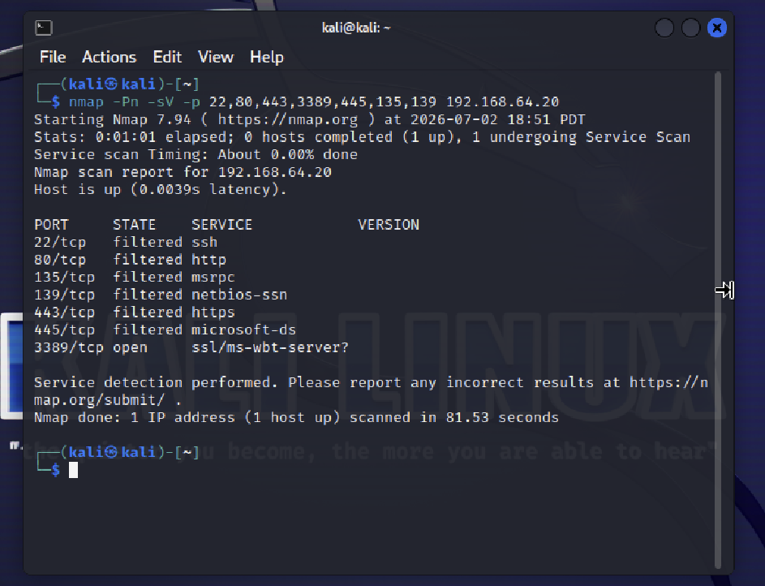
*Nmap scan from Kali identifying open and filtered ports on the Windows target*

### What could this attack do?

The scan revealed that **RDP (port 3389) is open**, while all other ports are filtered by Windows Firewall. This tells an attacker that:
- The machine is running Remote Desktop Protocol — a legitimate Windows service that allows remote access
- RDP is the primary attack surface available
- The firewall is otherwise well-configured, which means other common attack vectors (SMB lateral movement, HTTP exploits) are blocked

This intelligence is what led directly to Attack 2. The attacker now knows exactly what to target.

### Detection & Prevention

**Detection gap — documented honestly:**

Inbound port scans do not generate Windows Security Event Log entries by default. This logging approach (native audit policy, no Sysmon) does not capture network-layer reconnaissance. This is a real limitation of the logging configuration used in this lab, and is worth documenting explicitly — understanding what your detection stack *can't* see is as important as knowing what it can.

To detect port scans in a production environment, one of the following would be needed:
- **Sysmon Event ID 3** (Network Connection) — logs all inbound/outbound connections with process context
- **Windows Firewall logging** ingested into Splunk — captures dropped connection attempts per source IP
- **Network-level IDS** (e.g., Suricata, Zeek) monitoring the perimeter

**Prevention:** Windows Firewall was already blocking 6 of 7 scanned ports. The only exposed service was RDP, which was intentionally left open as our attack surface for lab purposes. In a real environment, RDP should be restricted to specific source IPs via firewall rules or disabled entirely in favor of a VPN + jump host architecture.

---

## Attack 2 — RDP Brute-Force (Hydra)

### What is this attack?

Remote Desktop Protocol (RDP) brute-forcing is one of the most common attack techniques in the wild. Because RDP allows full graphical remote access to a Windows machine, it's an extremely high-value target. Attackers use automated tools to rapidly try thousands of username/password combinations until one succeeds.

In real-world incidents, RDP brute-force is frequently the initial access vector for ransomware groups. Once they gain valid credentials, they log in via RDP, disable security controls, and deploy their payload.

### How the attack was executed

Hydra was used to attempt 10 password combinations against the `Harshvardhan` account via RDP:

```bash
# Create a password wordlist
cat > /tmp/passwords.txt << EOF
password
password123
admin
admin123
letmein
welcome
harshvardhan
kali123
P@ssw0rd
wrongpassword
EOF

# Launch the brute-force attack
hydra -l Harshvardhan -P /tmp/passwords.txt rdp://<WINDOWS-TARGET-IP> -t 1 -W 3
```

- `-l Harshvardhan` — target the specific username identified during reconnaissance
- `-t 1` — single thread (RDP does not handle parallel connections well)
- `-W 3` — 3-second wait between attempts to avoid triggering lockout too fast

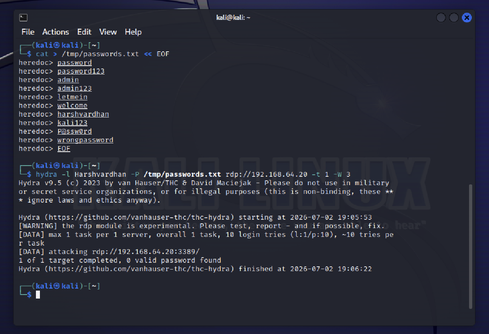
*Hydra executing 10 password attempts against the RDP service*

### What could this attack do?

If any of the passwords had matched, the attacker would have gained full interactive access to the Windows machine via Remote Desktop. From there, they could:
- Browse and exfiltrate files
- Install malware or backdoors
- Create new admin accounts
- Disable Windows Defender and other security controls
- Deploy ransomware or use the machine as a pivot point to attack other internal systems

The fact that no password succeeded in this lab scenario is irrelevant to the detection value — in a real incident, the brute-force activity would show up in logs regardless of whether it succeeded, and detecting it early allows defenders to block the attacker before they get in.

### Detection & Was it Caught?

**Yes — fully detected.**

Every failed logon attempt generated a **Windows Security Event ID 4625** (Failed Logon) with Logon Type 3 (network logon), source IP, and target account name. These events were forwarded to Splunk in real time.

```spl
index=main host=WIN-V47LD6TN0F4 EventCode=4625 Logon_Type=3
| table _time, Account_Name, Failure_Reason, Logon_Type, Source_Network_Address
```

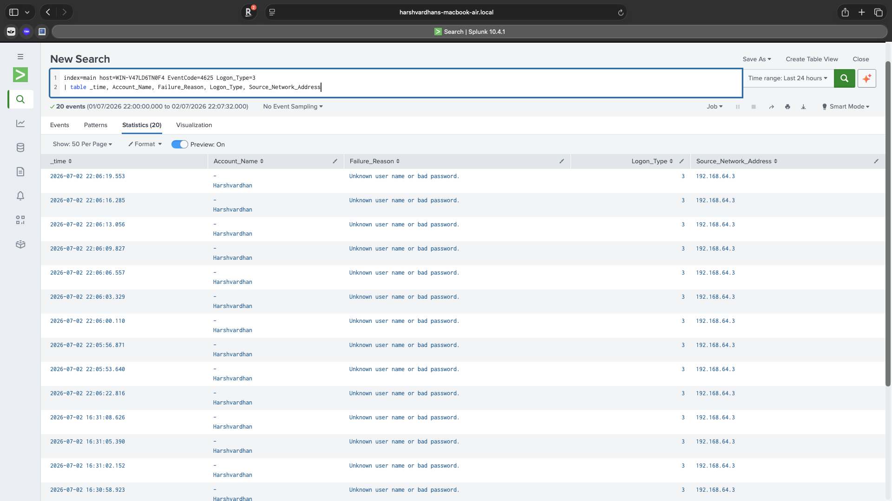
*Splunk capturing all 10 failed logon events — attacker IP <KALI-ATTACKER-IP> clearly visible*

The detection rule goes further — it uses time-bucketing to identify the *pattern* of rapid failed logons from a single source, which is the real indicator of brute-force behavior:

```spl
index=main host=WIN-V47LD6TN0F4 EventCode=4625 Logon_Type=3
| bucket _time span=5m
| stats count by _time, Account_Name, Source_Network_Address
| where count >= 5
```

This fires an alert whenever any source IP generates 5 or more failed logons against the same account within a 5-minute window — a threshold tunable to the environment.

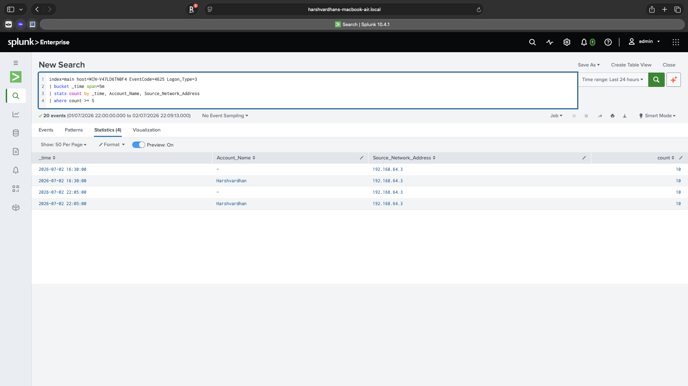
*Detection rule firing: 10 failed logons from <KALI-ATTACKER-IP> within a single 5-minute bucket*

**Prevention:** Account lockout policies can limit brute-force effectiveness by locking an account after a defined number of failed attempts. Additionally, restricting RDP access to specific source IPs via Windows Firewall rules would prevent external brute-force entirely.

---

## Attack 3 — Post-Compromise Reconnaissance

### What is this attack?

Once an attacker gains initial access to a system — whether via brute-force, phishing, or an exploit — their next step is almost always internal reconnaissance. They need to understand the environment: who else is on the machine, what software is running, what network they're connected to, and whether there are paths to higher-value targets.

This phase is called "living off the land" — attackers use built-in Windows tools (`whoami`, `net`, `systeminfo`, `ipconfig`, `Invoke-WebRequest`) rather than importing custom tools, because built-in utilities are less likely to trigger antivirus alerts. This makes process creation logging with full command-line capture especially important.

### How the attack was executed

The following commands were run from an elevated PowerShell session, simulating what an attacker would do immediately after gaining access:

```powershell
# Who am I? What privileges do I have?
whoami /all

# Who else has accounts on this machine?
net user

# What OS, hardware, and network configuration is this machine running?
systeminfo

# Simulate a C2 callback — trying to reach attacker-controlled infrastructure
Invoke-WebRequest -Uri "http://<KALI-ATTACKER-IP>" -UseBasicParsing -ErrorAction SilentlyContinue
```

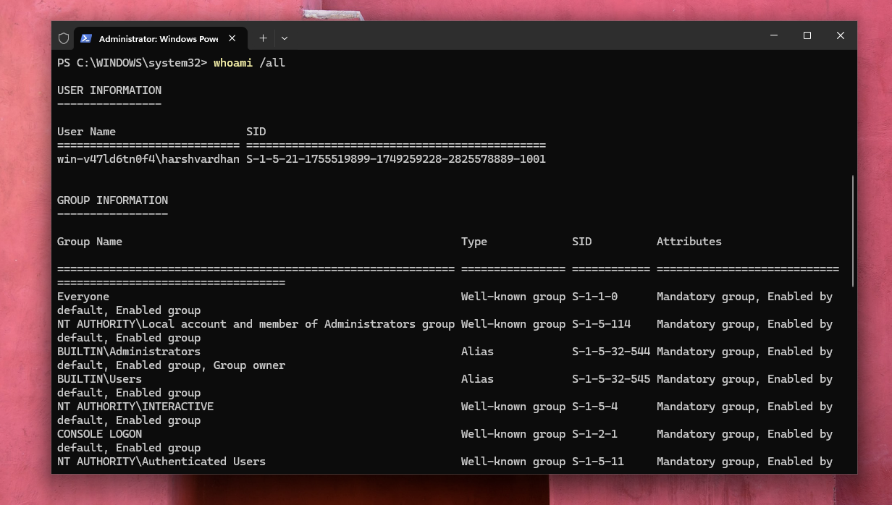
*Attacker enumerating their own user context, group memberships, and privilege level*

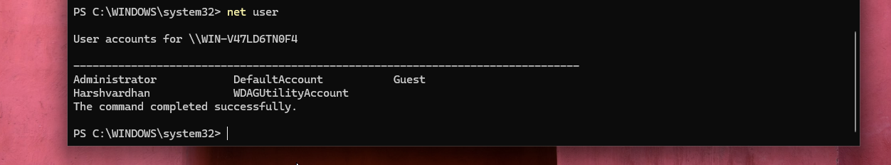
*Attacker enumerating all local user accounts on the machine*

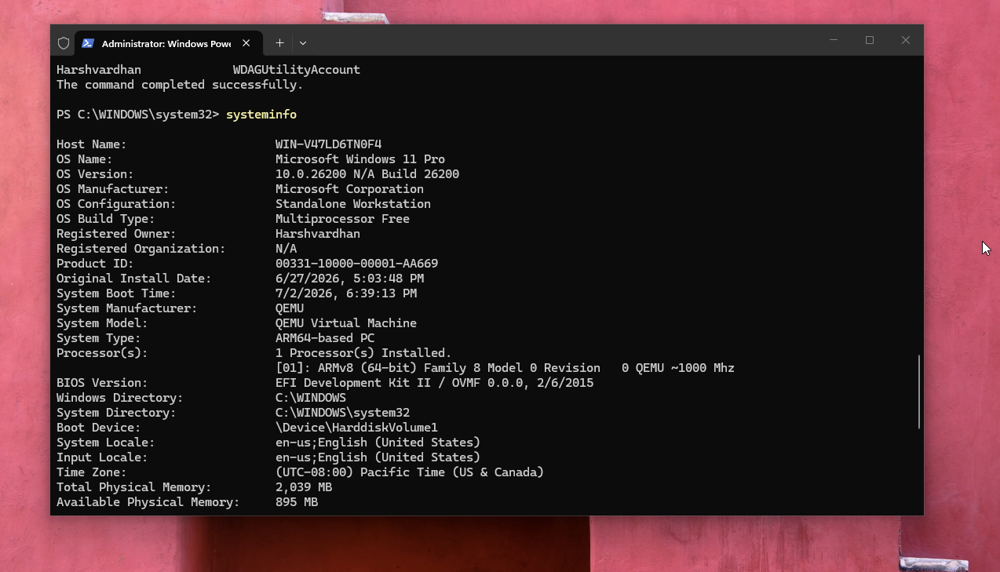
*Attacker collecting OS version, hostname, installed patches, and network configuration*

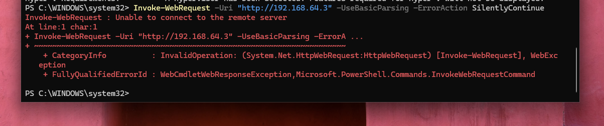
*Attacker attempting to reach command-and-control infrastructure at <KALI-ATTACKER-IP> — connection failed but the attempt was logged*

### What could this attack do?

The reconnaissance commands reveal:
- The user context and privileges available (useful for planning privilege escalation)
- Other accounts on the machine (potential lateral movement targets)
- OS version and patch level (helps identify unpatched vulnerabilities to exploit next)
- Network configuration (maps the internal network for further movement)

The `Invoke-WebRequest` to Kali's IP simulates a **C2 beacon** — a callback from the compromised machine to attacker-controlled infrastructure. In a real attack, this would establish a persistent command channel. Even though it failed here (nothing was listening on Kali), the attempt itself is a high-confidence indicator of compromise.

### Detection & Was it Caught?

**Yes — fully detected via two log sources.**

**EventCode 4688** (Process Creation with command-line) caught every recon tool execution:

```spl
index=main host=WIN-V47LD6TN0F4 EventCode=4688
| search Process_Command_Line="*whoami*" OR Process_Command_Line="*net user*"
    OR Process_Command_Line="*systeminfo*"
| table _time, Account_Name, Process_Command_Line, New_Process_Name
```

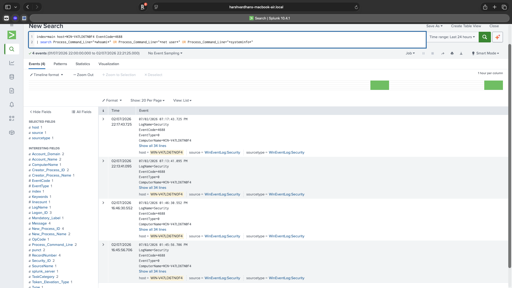
*Splunk surfacing whoami and systeminfo execution with full command-line arguments*

**PowerShell Operational log** caught the `Invoke-WebRequest` C2 beacon attempt:

```spl
index=main host=WIN-V47LD6TN0F4 source="WinEventLog:Microsoft-Windows-PowerShell/Operational"
| search Message="*Invoke-WebRequest*" OR Message="*WebClient*"
| table _time, Message
```

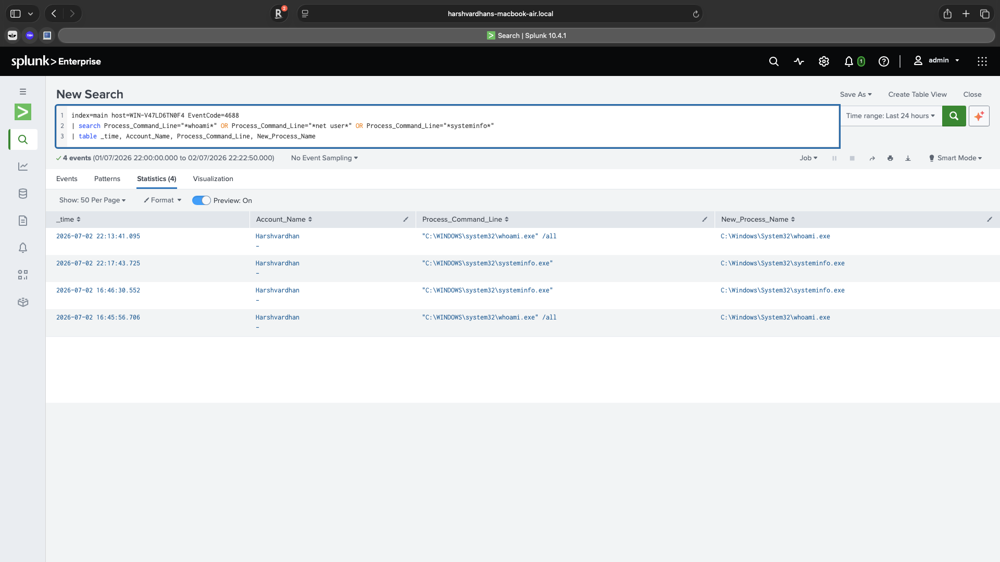
*Full detection view: recon tools caught via process creation logs and C2 beacon caught via PowerShell logging*

**Prevention:** Application allowlisting (Windows Defender Application Control) can restrict which executables can run. In practice, completely blocking tools like `whoami` and `systeminfo` on a workstation is difficult since they have legitimate uses — which is why *detection* rather than *prevention* is the primary control here. The goal is to catch the pattern of rapid sequential use of multiple recon tools, which is rare in normal user behavior.

---

## Attack 4 — Obfuscated PowerShell Execution

### What is this attack?

PowerShell is one of the most powerful tools available on Windows — and one of the most abused by attackers. Because it's built into every Windows installation, has deep system access, and can execute code entirely in memory without writing files to disk, it's the tool of choice for sophisticated attackers.

A common evasion technique is to **Base64-encode** the PowerShell command before executing it. The encoded string looks like meaningless garbage to a human analyst or simple string-matching security tool — the actual command is hidden. This is used to bypass basic detection rules, script block filtering in older configurations, and to hide the true intent of a command from casual inspection.

### How the attack was executed

```powershell
# Step 1: Define the actual malicious command
$command = "Get-LocalUser | Select-Object Name, Enabled, LastLogon; Get-NetIPAddress | Select-Object IPAddress"

# Step 2: Encode it in Base64 — this is what gets executed
$encoded = [Convert]::ToBase64String([Text.Encoding]::Unicode.GetBytes($command))
Write-Host "Encoded: $encoded"

# Step 3: Execute the encoded command — the actual payload is now hidden
powershell.exe -EncodedCommand $encoded
```

The plaintext command becomes:
```
RwBlAHQALQBMAG8AYwBhAGwAVQBzAGUAcgAgAHwAIABTAGUAbABlAGMAdAAt...
```

To anyone inspecting running processes, they would only see `powershell.exe -EncodedCommand RwBlAHQA...` — with no obvious indication of what the command is actually doing.

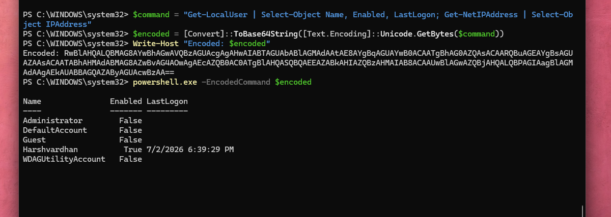
*The attacker's encoded command alongside the actual output it produced — user accounts and IP addresses exfiltrated*

### What could this attack do?

In this scenario, the encoded command enumerated local user accounts and network IP addresses — classic post-compromise intelligence gathering. But the same technique is used for far more dangerous payloads: downloading and executing malware, establishing persistence, exfiltrating data, or disabling security controls.

The encoding is purely evasive — it does nothing to change the capability of the command. It's designed to bypass detection, not to do something new. Understanding this distinction is important: the threat is in the capability, the encoding is just camouflage.

### Detection & Was it Caught?

**Yes — and this is the most important detection in the lab.**

Windows PowerShell Script Block Logging captures every command *before it executes* — and critically, it logs the **decoded** version. This means Base64 encoding provides zero protection against this log source. The attacker's hidden command is fully visible in Splunk:

```spl
index=main host=WIN-V47LD6TN0F4 source="WinEventLog:Microsoft-Windows-PowerShell/Operational"
| search Message="*EncodedCommand*" OR Message="*Get-LocalUser*"
| eval Message=substr(Message, 1, 500)
| table _time, Message
| head 5
```

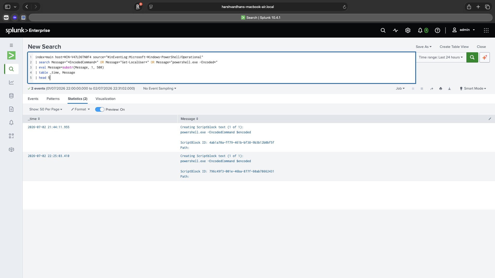
*Splunk capturing the EncodedCommand execution — the obfuscation attempt is visible*

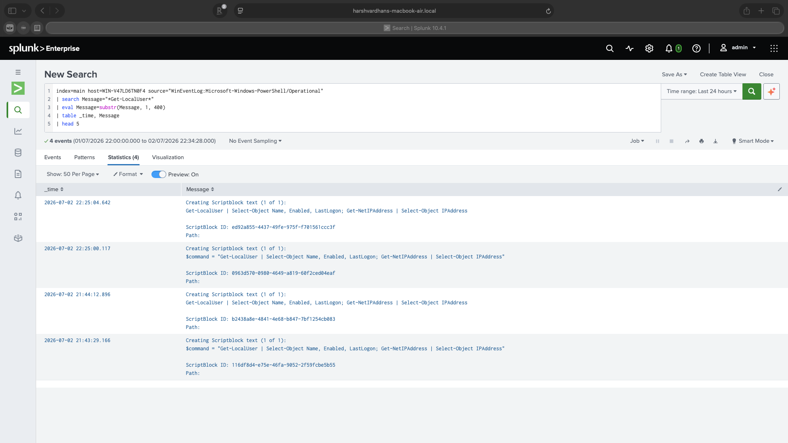
*The smoking gun: Script Block logging automatically decoded the Base64 payload. The real command — Get-LocalUser and Get-NetIPAddress — is fully visible in Splunk despite the attacker's obfuscation*

**Prevention:** PowerShell Constrained Language Mode restricts which .NET types and methods can be called, limiting the damage a PowerShell-based attacker can do. Additionally, PowerShell v2 — which predates Script Block Logging and can be used to bypass it — should be disabled on all modern systems:

```powershell
# Disable PowerShell v2 to prevent logging bypass
Disable-WindowsOptionalFeature -Online -FeatureName MicrosoftWindowsPowerShellV2Root
```

---

## MITRE ATT&CK Summary

| # | Technique ID | Technique Name | Tool Used | Detection Method | Caught? |
|---|---|---|---|---|---|
| 1 | T1046 | Network Service Discovery | Nmap | N/A — detection gap (no Sysmon/firewall logging) | ⚠️ Not detected at network layer |
| 2 | T1110.001 | Brute Force: Password Guessing | Hydra | EventCode 4625 — 5+ failed logons from single IP in 5 min | ✅ Detected |
| 3 | T1082 / T1033 | System Info / User Discovery | PowerShell built-ins | EventCode 4688 — recon tool execution with command-line args | ✅ Detected |
| 3 | T1071.001 | C2 over HTTP | Invoke-WebRequest | PowerShell/Operational log — outbound connection attempt | ✅ Detected |
| 4 | T1027 / T1059.001 | Obfuscation / PowerShell | PowerShell -EncodedCommand | Script Block Logging — decoded payload captured | ✅ Detected |

---

## Key Takeaways

**Logging configuration is the foundation of detection.** Without enabling process creation auditing, command-line argument capture, and PowerShell Script Block Logging, most of the attacks in this lab would have been invisible in Splunk. The first step in building detection capability is making sure the right events are being generated before worrying about detection rules.

**Know your detection gaps.** Attack 1 (port scanning) was not caught by this logging setup — and documenting that honestly is more valuable than pretending full coverage exists. Real SOC engineers spend significant time mapping detection gaps and communicating coverage limitations to stakeholders. In a production environment, network-layer visibility (Sysmon, firewall logging, IDS) would fill this gap.

**Encoding does not equal encryption.** Attack 4 demonstrated a core principle: Base64 encoding is not a security control. It hides commands from casual inspection and bypasses naive string-matching rules, but Script Block Logging defeats it completely by capturing the decoded command before execution. Defenders who understand this have a significant advantage over attackers who rely on encoding as their primary evasion technique.

**Detection engineering is about patterns, not just signatures.** The RDP brute-force detection (Attack 2) doesn't fire on a single failed logon — it fires when the *pattern* of multiple rapid failures from a single source IP is detected. This approach, using time-bucketing and statistical thresholds, generates far fewer false positives than basic keyword matching and much more closely reflects how real SOC alert logic is designed.

---

## Related Projects

- [AD Attack & Defense Lab](https://github.com/harshh211/AD-Attack-Defense-Lab) — Azure-hosted Active Directory domain with full attack chain (AD enumeration → Pass-the-Hash → credential dumping) and hardening via LDAP signing and Protected Users Group
- [vulnscan](https://github.com/harshh211/vulnscan) — Multi-threaded Python vulnerability scanner with NVD API CVE lookup

